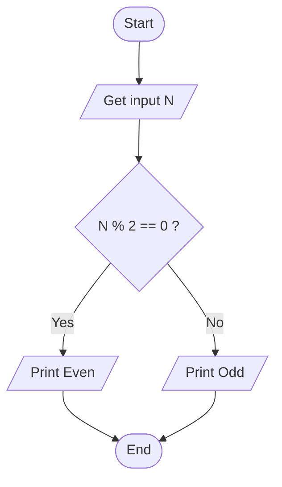
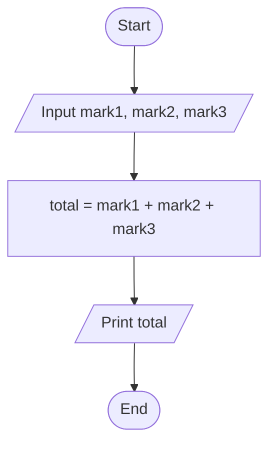
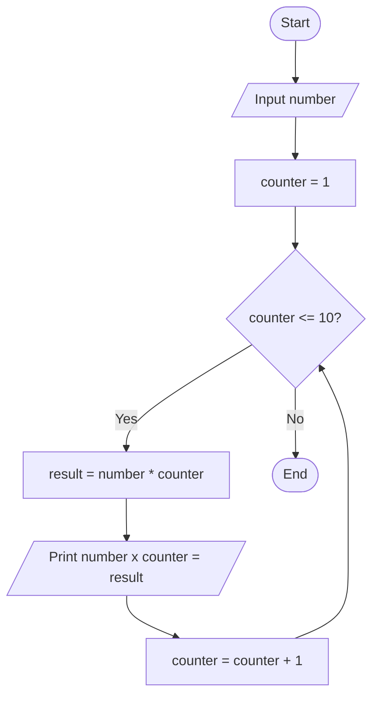
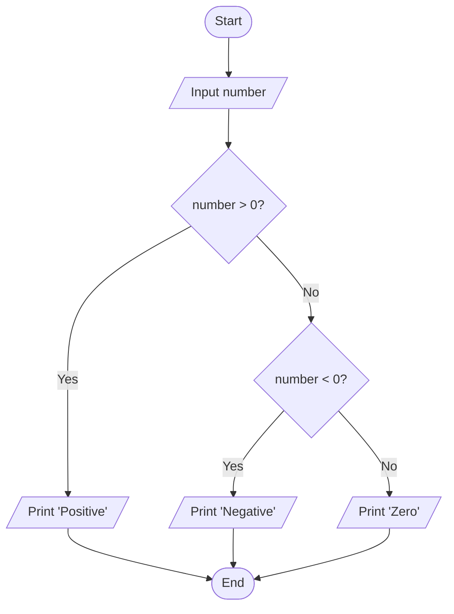
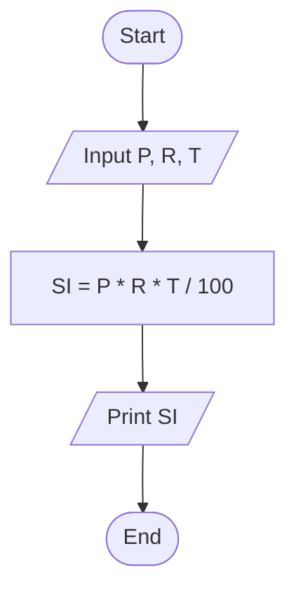
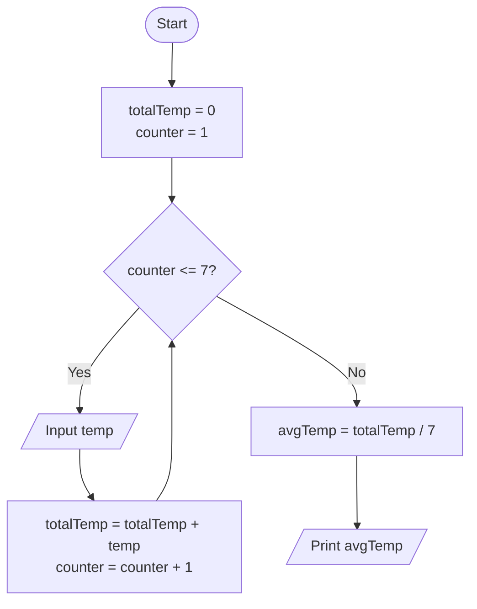
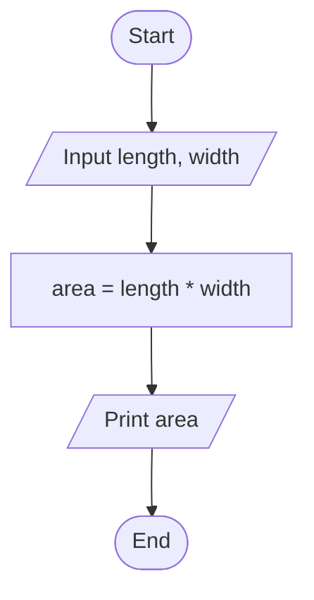
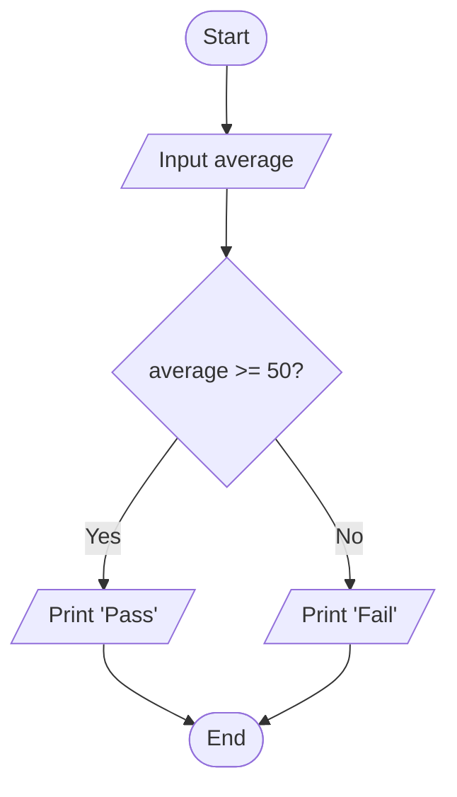
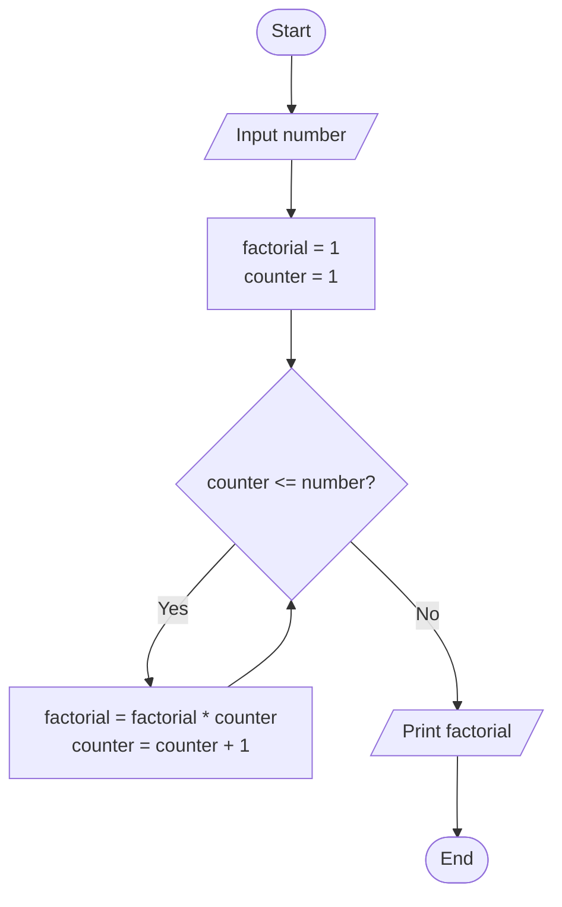
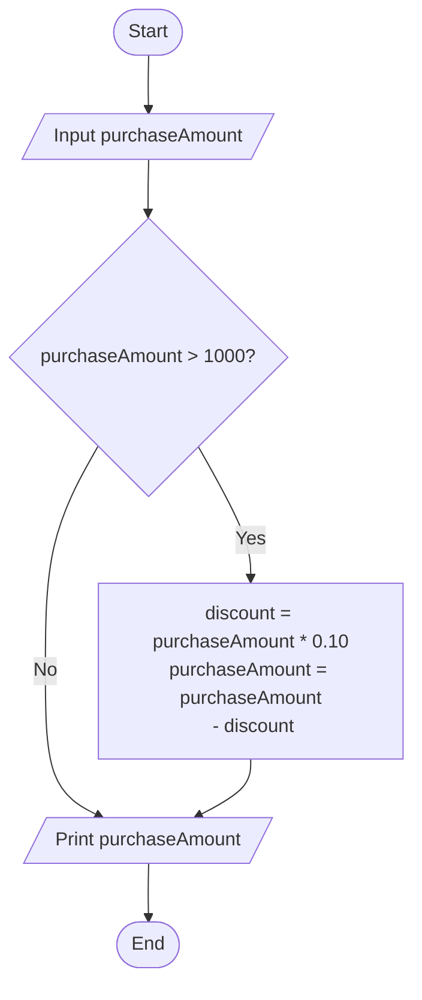

## 1. Check Even or Odd Number

Design an algorithm and flowchart that take a number as input and
determine whether it is even or odd.

### ✔ Pseudocode

```text
START
    INPUT number
    IF number % 2 == 0 THEN
        PRINT Even
    ELSE
        PRINT Odd
    ENDIF
END
```

### ✔ Flowchart



---

## 2. Calculate Total and Average Marks

Write the algorithm and draw the flowchart for a program that inputs
marks for 3 subjects, calculates the total and average, and displays
both.
### ✔ Pseudocode
```text
START
    INPUT mark1, mark2, mark3
    total = mark1 + mark2 + mark3
    average = total / 3
     PRINT total
     print average
    
END
```
### ✔ Flowchart


---

## 3. Display Multiplication Table

Create an algorithm and flowchart that input a number and display its
multiplication table from 1 to 10 using a loop.

### ✔ Pseudocode
```text
START

INPUT number
counter = 1
WHILE counter <= 10 DO
result = number * counter
PRINT number + " x " + counter + " = " + result
counter = counter + 1
ENDWHILE

END
```
### ✔ Flowchart


---

## 4. Positive, Negative, or Zero Check

Write the algorithm and flowchart to input a number and display whether
it is positive, negative, or zero.
### ✔ Pseudocode

```text

START
   INPUT number
   IF number > 0 THEN
   PRINT "positive"
   ELSE IF number < 0 THEN
   PRINT "negative"
   ELSE
   PRINT "zero"
   ENDIF
    
END

```
### ✔ Flowchart



---

## 5. Simple Interest Calculator

Create an algorithm and flowchart for a program that calculates simple
interest using the formula:

**SI = (P × R × T) / 100**

- **P = Principal** → original amount of money
- **R = Rate of Interest** → percentage per year
- **T = Time** → number of years

### ✔ Pseudocode
```text
START
INPUT P, R, T 
SI = (P * R * T) / 100
PRINT SI
END
```
### ✔ Flowchart


---

## 6. Average Temperature Calculation

Write the algorithm and draw the flowchart for a program that takes the
temperature of 7 days, finds the average temperature, and displays it.

### ✔ Pseudocode
```text
START
totalTemp = 0
counter = 1
WHILE counter <= 7 DO
INPUT temp
totalTemp = totalTemp + temp
counter = counter + 1
ENDWHILE
avgTemp = totalTemp / 7
PRINT avgTemp
END
```
### ✔ Flowchart


---

## 7. Calculate Area of a Rectangle

Create an algorithm and flowchart to input length and width, calculate
the area (**Area = Length × Width**), and display the result.

### ✔ Pseudocode
```text
START
INPUT length, width
area = length * width
PRINT area
END
```

### ✔ Flowchart


## 8. 

Write the algorithm and draw the flowchart for a program that takes a
student's average marks and displays **"Pass"** if average ≥ 50,
otherwise **"Fail"**.

### ✔ Pseudocode
```text
START
INPUT average
IF average >= 50 THEN
PRINT "Pass"
ELSE
PRINT "Fail"
ENDIF
END
```
### ✔ Flowchart

---
```
## 9. Calculate Factorial of a Number

Write the algorithm and draw the flowchart that input a number and
calculate its factorial using a loop.

### ✔ Pseudocode
```text
START
INPUT number
factorial = 1
counter = 1
WHILE counter <= number DO
factorial = factorial * counter
counter = counter + 1
ENDWHILE
PRINT factorial
END
```
### ✔ Flowchart

---

## 10. Calculate Discount on Purchase

Write the algorithm and draw the flowchart for a program that inputs the
purchase amount and gives a **10% discount** if the amount is greater
than 1000.

### ✔ Pseudocode
```text
START
INPUT purchaseAmount
IF purchaseAmount > 1000 THEN
discount = purchaseAmount * 0.10
purchaseAmount = purchaseAmount - discount
ENDIF
PRINT purchaseAmount
END

```
### ✔ Flowchart


---
